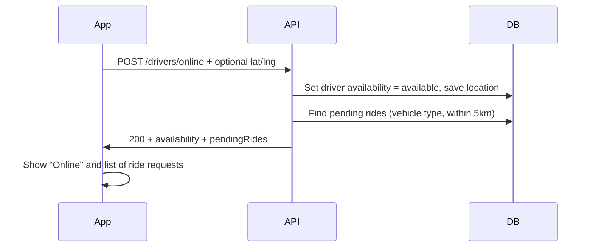

# Driver Online API – Flutter Implementation Guide

This document describes how the **driver “go online”** flow works and how to implement it in the Baneen Flutter app.

---

## Base URL and auth

- **Base URL:** `https://baneen-fullbackend.onrender.com/api/v1`
- **Auth:** Driver access token (JWT) in header:
  ```http
  Authorization: Bearer <driver_access_token>
  ```
- All driver endpoints require the user to be logged in as a **driver** (role `driver`).

---

## What “go online” does

When the driver taps **“Go online”** in the app:

1. The backend sets the driver’s status to **available** (online).
2. Optionally, the driver’s **current location** is updated (recommended so they can receive nearby ride requests).
3. The backend fetches **pending ride requests** that match this driver (vehicle type, within 5 km, etc.).
4. The same API response returns both **availability** and the **list of pending rides**, so the app can show ride requests immediately without a second call.

So: **one “go online” request → driver is online + list of ride requests** (if location was sent and there are matching requests).

---

## API: Go online and get ride requests

**Endpoint:** `POST /drivers/online`

**Headers:**

| Header             | Value                    |
|--------------------|--------------------------|
| `Authorization`    | `Bearer <driver_token>`  |
| `Content-Type`     | `application/json`      |

**Body (optional but recommended):**

Send the driver’s current location so the backend can return **nearby** pending rides. If you don’t send location, the driver is still marked online but `pendingRides` will usually be empty.

| Field       | Type   | Required | Description                    |
|------------|--------|----------|--------------------------------|
| `latitude` | number | No*      | Driver’s current latitude      |
| `longitude`| number | No*      | Driver’s current longitude     |
| `address`  | string | No       | Optional human-readable address|

\* Not required for going online, but **strongly recommended**. Without location, the driver won’t get pending rides in the response (and won’t match new passenger requests until location is sent later).

**Example request:**

```http
POST https://baneen-fullbackend.onrender.com/api/v1/drivers/online
Authorization: Bearer <driver_access_token>
Content-Type: application/json

{
  "latitude": 31.5204,
  "longitude": 74.3587,
  "address": "Lahore, Pakistan"
}
```

**Example success response (200):**

```json
{
  "success": true,
  "message": "Driver is now online. 2 ride request(s) available.",
  "data": {
    "availability": {
      "status": "available",
      "currentLocation": {
        "latitude": 31.5204,
        "longitude": 74.3587,
        "address": "Lahore, Pakistan"
      },
      "lastUpdated": "2025-03-07T12:00:00.000Z"
    },
    "status": "ONLINE",
    "pendingRides": [
      {
        "rideId": "507f1f77bcf86cd799439011",
        "pickup": {
          "address": "123 Main St, Lahore",
          "coordinates": { "latitude": 31.52, "longitude": 74.35 }
        },
        "dropoff": {
          "address": "Airport Road, Lahore",
          "coordinates": { "latitude": 31.55, "longitude": 74.38 }
        },
        "fare": 350,
        "fareBreakdown": { "baseFare": 100, "distanceFare": 150, "timeFare": 100 },
        "distance": 5000,
        "duration": 600,
        "paymentMethod": "cash",
        "notes": "",
        "passenger": {
          "id": "507f1f77bcf86cd799439012",
          "name": "Ali Khan",
          "rating": 4.5
        },
        "driverDistance": { "km": 1.2, "text": "1.2 km" },
        "driverETA": { "minutes": 4, "text": "4 min" },
        "requestedAt": "2025-03-07T11:58:00.000Z"
      }
    ],
    "pendingRidesCount": 2
  }
}
```

When there are **no** pending rides (or location was not sent / driver not eligible):

```json
{
  "success": true,
  "message": "Driver is now online",
  "data": {
    "availability": { "status": "available", "currentLocation": null, "lastUpdated": "..." },
    "status": "ONLINE",
    "pendingRides": [],
    "pendingRidesCount": 0
  }
}
```

**Error responses:**

- **401** – Missing or invalid token.
- **403** – User is not a driver.
- **404** – Driver profile not found (driver must complete profile first).
- **500** – Server error.

---

## How it works (flow)



- **Going online:** Backend updates the driver’s availability to `available` and, if provided, stores `currentLocation`.
- **Pending rides:** Only rides that are **pending**, match the driver’s **vehicle type**, and have pickup within **5 km** of the driver’s location are returned. Drivers without a stored location get an empty list.
- **Real-time new requests:** After the driver is online, new passenger ride requests are pushed to **connected** drivers via Socket.io (`ride:new_request`). So the app should also connect to the socket with the driver token to receive new requests without polling.

---

## Flutter implementation guide

### 1. When the user taps “Go online”

1. Get the driver’s current location (e.g. `geolocator` or `location`).
2. Call `POST /drivers/online` with:
   - Header: `Authorization: Bearer <accessToken>`
   - Body: `{ "latitude": lat, "longitude": lng }` (and optional `"address"` if you have it).
3. On success:
   - Update UI to “Online” and show `data.availability` if needed.
   - If `data.pendingRidesCount > 0`, show the list `data.pendingRides` (e.g. a list or bottom sheet) so the driver can tap to accept a ride.
4. On error: show message (e.g. “Driver profile not found”, “Unauthorized”).

### 2. Showing pending rides in the UI

- Use `data.pendingRides` from the go-online response. Each item has:
  - `rideId` – use for “Accept” (e.g. `PUT /rides/:id/accept`).
  - `pickup`, `dropoff` – address and coordinates for map/list.
  - `fare`, `paymentMethod`, `passenger`, `driverDistance`, `driverETA`, `requestedAt`.
- You can show a list of cards; on tap, call the accept-ride API with `rideId`.

### 3. Getting fresh pending rides (polling or refresh)

- To refresh the list without going offline/online again, call:
  - **GET** `https://baneen-fullbackend.onrender.com/api/v1/rides/pending-for-driver`
  - Same auth header.
- Returns the same shape: `{ rides: [...], count }`. Use this for a “Refresh” button or periodic polling while the driver is on the home screen.

### 4. Receiving new requests in real time (Socket)

- Connect to Socket.io with the driver’s JWT (same as in `LIVE_TRACKING_API.md`, Socket URL = `https://baneen-fullbackend.onrender.com`).
- Listen for event: **`ride:new_request`**.
- Payload is similar to one item in `pendingRides` (rideId, pickup, dropoff, fare, passenger, driverDistance, driverETA, etc.). When you receive it, add it to the pending list in the UI so the driver can accept without refreshing.

### 5. Going offline

- Use **PUT** `/drivers/availability` with body: `{ "status": "offline" }` (and optionally `currentLocation` if you still want to update it). No need to call “online” again until the driver taps “Go online” again.

---

## Checklist for Flutter team

- [ ] On “Go online” tap: get device location, then call `POST /drivers/online` with `latitude`, `longitude` in body and `Authorization: Bearer <token>`.
- [ ] Parse `data.availability`, `data.status`, `data.pendingRides`, `data.pendingRidesCount` from the response.
- [ ] Show “Online” state and display `pendingRides` (e.g. list of ride request cards).
- [ ] “Accept” button: call `PUT /rides/:rideId/accept` with the selected `rideId` (see main API docs).
- [ ] Optional: “Refresh” pending list via `GET /rides/pending-for-driver`.
- [ ] Optional: connect Socket.io and listen for `ride:new_request` to add new requests in real time.
- [ ] Handle 404 (profile not found) and 401 (token expired) with clear messages.

---

## Related endpoints

| Purpose              | Method | Endpoint                        |
|----------------------|--------|---------------------------------|
| Go online + get rides| POST   | `/drivers/online`               |
| Refresh pending list | GET    | `/rides/pending-for-driver`    |
| Update location only| PUT    | `/drivers/availability` or `/rides/driver/availability` |
| Accept a ride       | PUT    | `/rides/:id/accept`             |
| Go offline          | PUT    | `/drivers/availability` with `status: "offline"` |

For live tracking after a ride has started, see **LIVE_TRACKING_API.md**.
