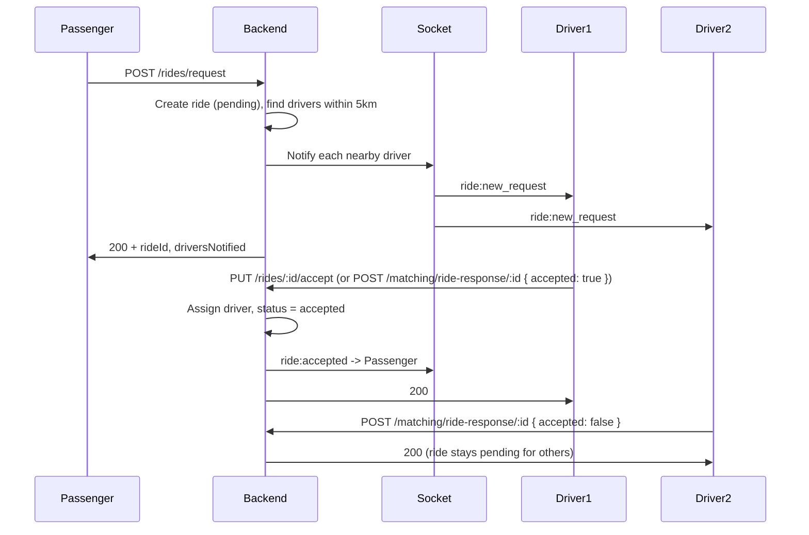

# Ride Request Flow – Real-Time Request, Accept & Reject

This document describes how ride requests work like real apps: **passenger requests → request is sent to all nearby drivers immediately → drivers can accept or reject**.

---

## Base URL and auth

- **Base URL:** `https://baneen-fullbackend.onrender.com/api/v1`
- **Auth:** Send JWT in header: `Authorization: Bearer <access_token>`
- **Socket URL:** `https://baneen-fullbackend.onrender.com` (for real-time events)

---

## Flow overview



1. **Passenger** requests a ride → backend creates the ride and sends **only to drivers within 5 km** via Socket (`ride:new_request`).
2. **Drivers** receive the request in real time (if app is connected to Socket) or see it in their pending list (e.g. after going online or refreshing).
3. **Driver accepts** → backend assigns the driver to the ride and notifies the passenger (`ride:accepted`).
4. **Driver rejects** → backend just records the response; ride stays **pending** so other drivers can still accept.

---

## 1. Passenger: Request a ride

**Endpoint:** `POST /rides/request`

**Headers:** `Authorization: Bearer <passenger_token>`, `Content-Type: application/json`

**Body (example):**

```json
{
  "pickupLocation": "123 Main St, Lahore",
  "dropoffLocation": "Airport Road, Lahore",
  "pickupCoords": { "latitude": 31.52, "longitude": 74.35 },
  "dropoffCoords": { "latitude": 31.55, "longitude": 74.38 },
  "vehicleType": "car",
  "paymentMethod": "cash",
  "notes": ""
}
```

**What the backend does:**

- Creates the ride with status `pending`.
- Finds drivers who are **online**, **approved**, **same vehicle type**, and **within 5 km** of the pickup.
- Sends the request to **each of those drivers** in real time via Socket.io: event **`ride:new_request`** with ride details (rideId, pickup, dropoff, fare, passenger, driverDistance, driverETA, etc.).
- Returns the ride summary and `driversNotified` (number of drivers who received the request).

**Response (200):**

```json
{
  "success": true,
  "data": {
    "rideId": "...",
    "status": "pending",
    "driversNotified": 3,
    "message": "Ride requested successfully. Notified 3 nearby drivers.",
    ...
  }
}
```

If **no drivers are within 5 km**, the backend returns **400** with message:  
`No drivers nearby at the moment. Please try again in a few minutes.`

**Flutter (passenger):** After calling `POST /rides/request`, connect to Socket (if not already) and listen for **`ride:accepted`** so you can show “Driver on the way” as soon as a driver accepts.

---

## 2. Driver: Receive the request (real time)

Drivers get the request in two ways:

### A. Socket (real time, recommended)

- Connect to Socket with the **driver** JWT.
- Listen for event: **`ride:new_request`**.
- Payload includes: `rideId`, `pickup`, `dropoff`, `fare`, `passenger`, `driverDistance`, `driverETA`, `requestedAt`, etc.
- When received, show a notification or add the ride to the “pending requests” list so the driver can **Accept** or **Reject**.

### B. Pending list (polling / after go online)

- **GET** `/rides/pending-for-driver` – returns all pending rides that match the driver (vehicle type, within 5 km). Same shape as each `ride:new_request` item.
- Use this when the driver opens the app or taps “Refresh”, or after **POST /drivers/online** (which already returns `pendingRides`).

---

## 3. Driver: Accept the ride

**Option 1 (recommended):**  
**Endpoint:** `PUT /rides/:id/accept`  
**Path:** `:id` = `rideId` from the request.  
**Headers:** `Authorization: Bearer <driver_token>`  
**Body:** none (or empty `{}`).

**Option 2:**  
**Endpoint:** `POST /matching/ride-response/:rideId`  
**Body:** `{ "accepted": true }`  
**Headers:** `Authorization: Bearer <driver_token>`

**What the backend does:**

- Checks the ride is `pending` and the driver is allowed to accept it (distance, vehicle type, etc.).
- Sets `ride.driverId` to this driver and `ride.status` to `accepted`.
- Notifies the **passenger** via Socket: **`ride:accepted`** (driver info, pickup, ETA, etc.).
- Returns success and ride details.

**Flutter (driver):** On “Accept” button, call `PUT /rides/:rideId/accept` (or the matching endpoint). On success, navigate to “Ride accepted” / “Go to pickup” screen.  
**Flutter (passenger):** Listen for **`ride:accepted`** on Socket and show driver details and map.

---

## 4. Driver: Reject the ride

**Endpoint:** `POST /matching/ride-response/:rideId`  
**Path:** `:rideId` = the ride ID from the request.  
**Headers:** `Authorization: Bearer <driver_token>`  
**Body:** `{ "accepted": false }`

**What the backend does:**

- Records that this driver responded; the ride **stays** `pending` (no driver assigned).
- Other nearby drivers can still accept it.
- Returns success with `action: 'RIDE_REJECTED'`.

**Flutter (driver):** On “Reject” button, call `POST /matching/ride-response/:rideId` with `{ "accepted": false }`. On success, remove this ride from the driver’s pending list (or mark as “Declined”).

---

## Summary for Flutter

| Role      | Action            | API / Socket |
|-----------|-------------------|--------------|
| Passenger | Request ride      | `POST /rides/request` |
| Passenger | Know when accepted| Socket: **`ride:accepted`** |
| Driver    | Get new requests  | Socket: **`ride:new_request`** and/or `GET /rides/pending-for-driver` |
| Driver    | Accept            | `PUT /rides/:id/accept` or `POST /matching/ride-response/:id` with `{ "accepted": true }` |
| Driver    | Reject            | `POST /matching/ride-response/:id` with `{ "accepted": false }` |

- Only **nearby** drivers (within 5 km of pickup) receive the request.
- Accept and reject are both supported; reject does not cancel the ride, it just lets other drivers accept.

For going online and seeing pending rides, see **DRIVER_ONLINE_API.md**. For live tracking after the ride starts, see **LIVE_TRACKING_API.md**.
